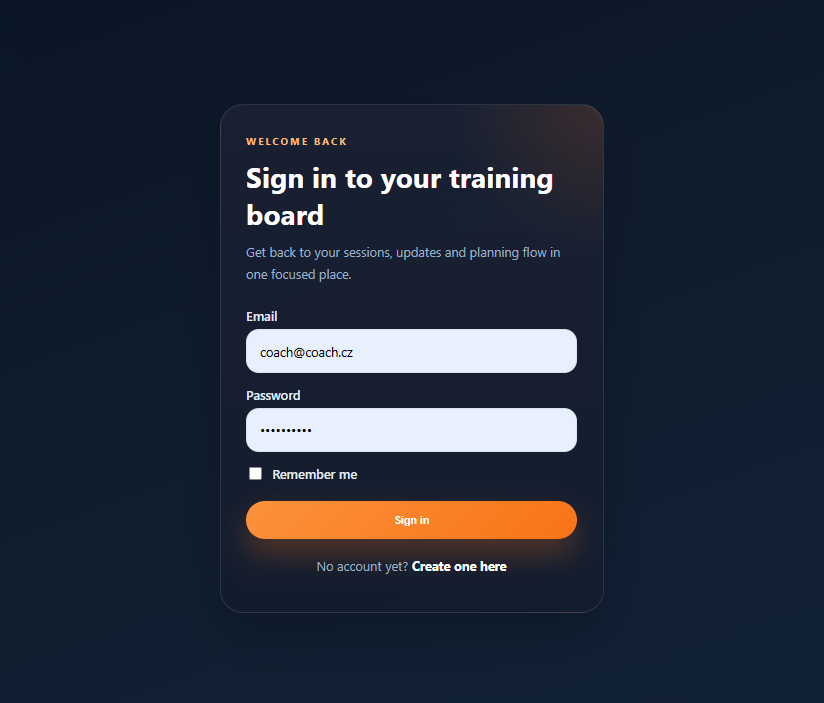
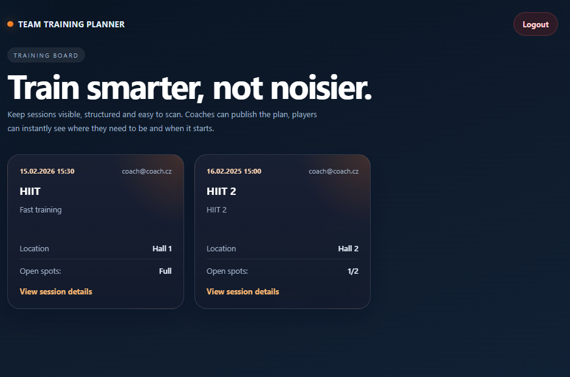
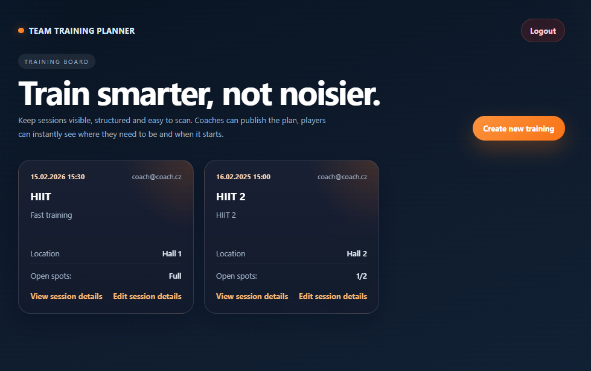
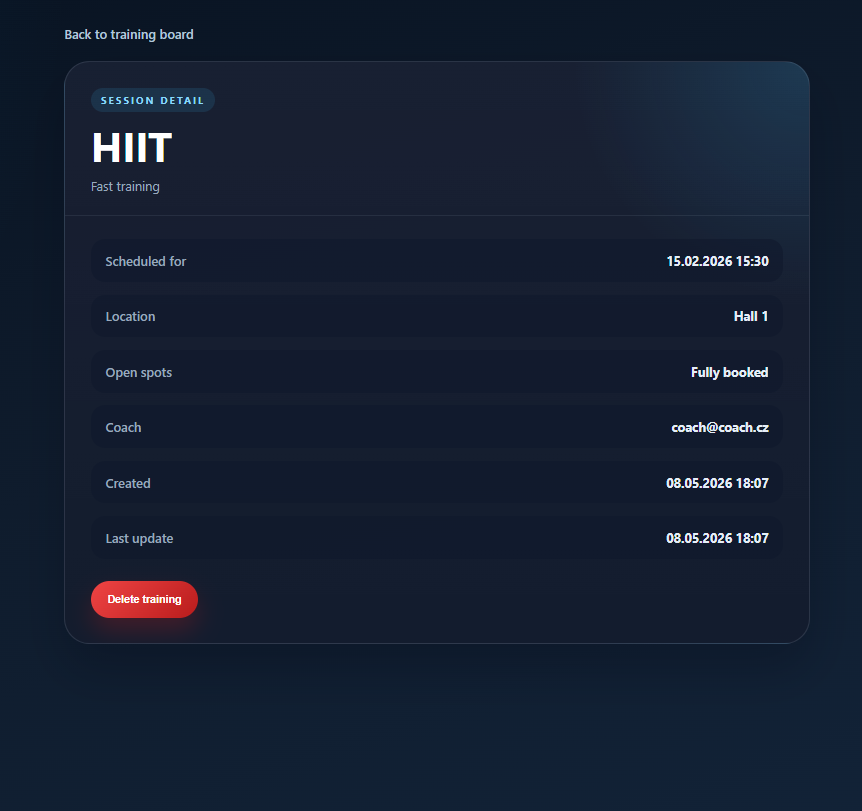

# TeamTrainingPlanner

This is a Symfony learning project focused on authentication, role-based access, training management, attendance, and capacity rules.

The application allows coaches to create and manage training sessions, while regular users can join and leave sessions with capacity protection and attendance validation.

## Main Features

- Landing page with authenticated redirect flow
- Login, logout, and registration
- Coach-only training create
- Training list and training detail page
- Training create, edit, and delete
- Ownership-based access for edit and delete
- Join and leave training flow
- Attendance unique constraint for one user per training
- Capacity validation for full trainings
- Flash messages for important actions
- Basic functional controller tests for access rules

## Technologies

- PHP
- Symfony
- Doctrine
- PostgreSQL
- Twig
- HTML
- CSS

## What I Practiced

- Symfony routes and controllers
- GET and POST request flow
- Doctrine entities and relations
- Working with repositories
- Form handling
- Redirects and flash messages
- Authentication and authorization
- Role-based and ownership-based access control
- Attendance and capacity business logic
- First functional controller tests with PHPUnit

## Setup

```bash
composer install
php bin/console doctrine:database:create
php bin/console doctrine:migrations:migrate
symfony serve
```

## Screenshots

### Login - Coach



### Training List - User



### Training List - Coach



### Training Detail - Coach



## Note

This project is a learning exercise focused on Symfony backend fundamentals such as authentication, ownership, roles, Doctrine relations, attendance flow, and capacity checks.

Basic functional access tests are included. More advanced join and leave controller tests were started, but the full auth and CSRF test setup was left outside the current project scope.
