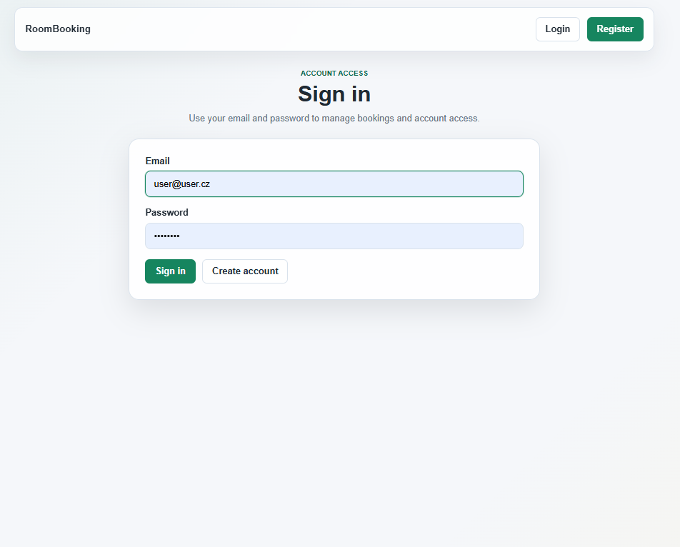
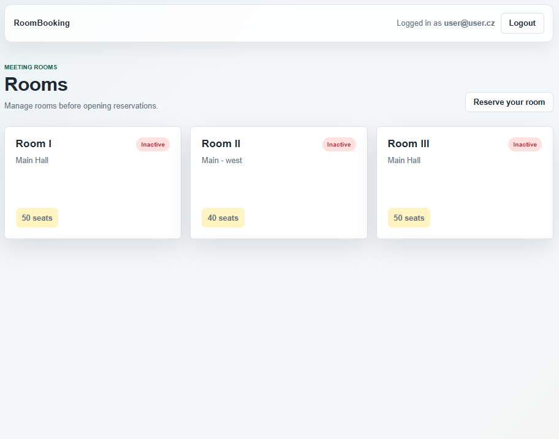
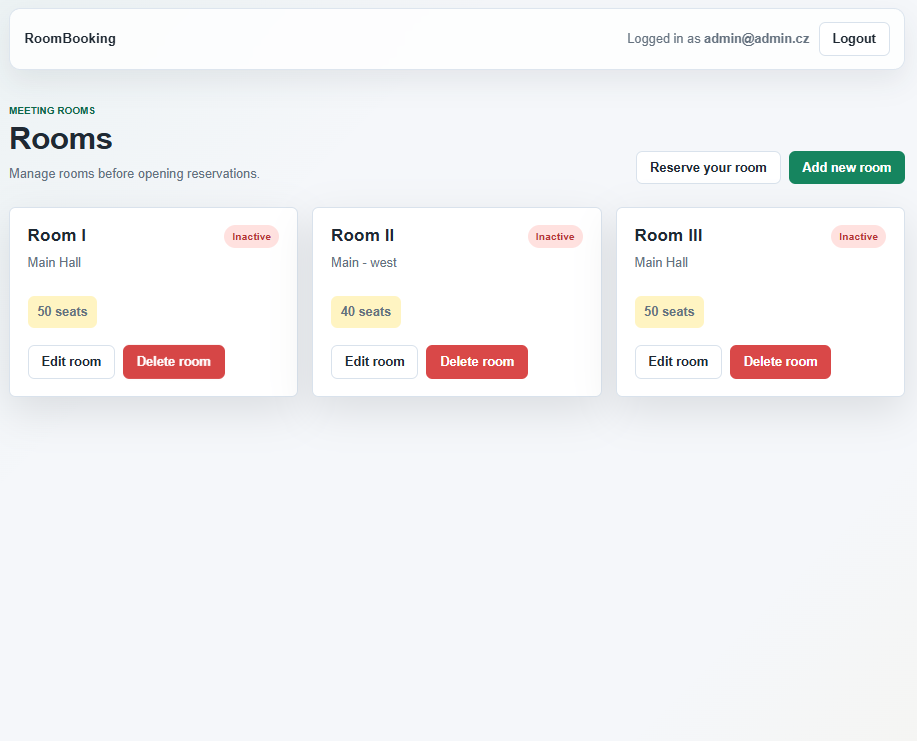
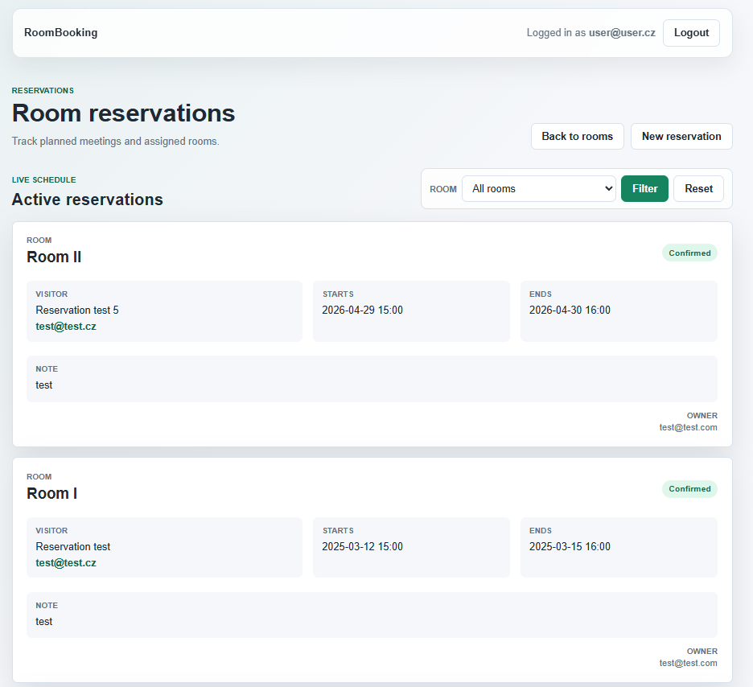
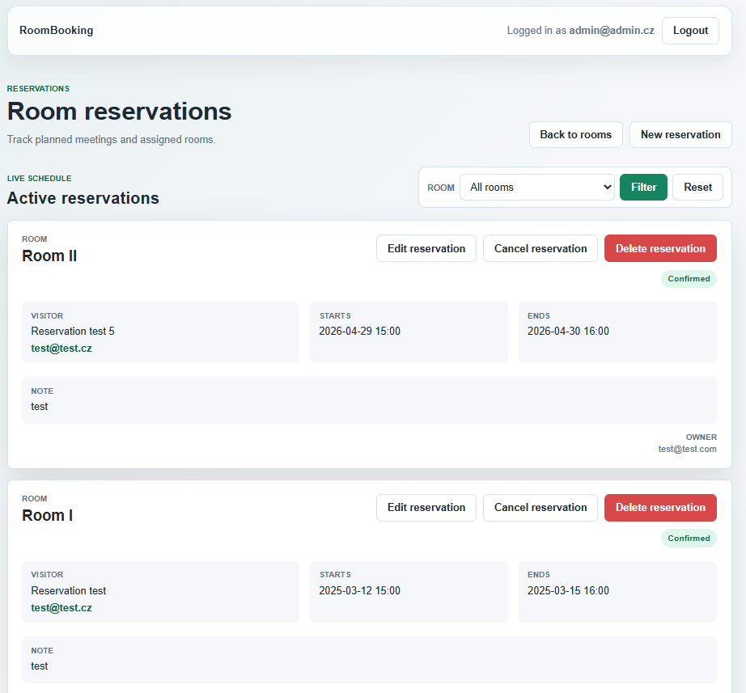
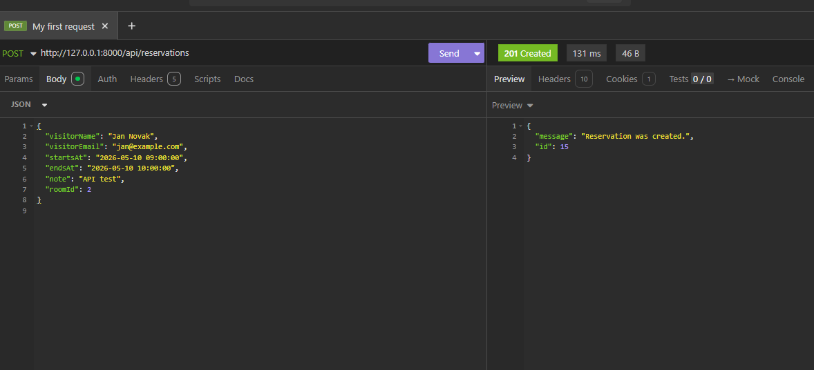

# RoomBooking

This is a Symfony learning project focused on room booking, authentication, ownership, and basic REST API endpoints.

The application allows managing rooms, creating reservations, editing and cancelling reservations, and working with protected API routes.

## Main Features

- Room list
- Room create, edit, and delete
- Reservation list with active and cancelled sections
- Create, edit, cancel, and delete reservations
- Reservation conflict validation
- Login, logout, and registration
- Admin-only room management
- Ownership-based reservation access
- Room filter for reservations
- Basic REST API for rooms and reservations

## Technologies

- PHP
- Symfony
- Doctrine
- PostgreSQL
- Twig
- HTML
- CSS

## What I Practiced

- Symfony routes and controllers
- GET and POST request flow
- Doctrine entities and relations
- Working with repositories
- Form handling and validation
- Redirects and flash messages
- Authentication and authorization
- Role-based and ownership-based access control
- Returning JSON responses from API endpoints
- Testing API endpoints with Insomnia

## Setup

```bash
composer install
php bin/console doctrine:database:create
php bin/console doctrine:migrations:migrate
symfony serve
```

## Screenshots

### Login



### Room List - User



### Room List - Admin



### Reservation List - User



### Reservation List - Admin



### API Test in Insomnia



## Note

This project is a learning exercise, but unlike the earlier session-based projects it uses Doctrine, PostgreSQL, authentication, and a small protected REST API.
